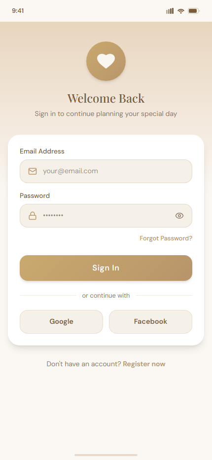
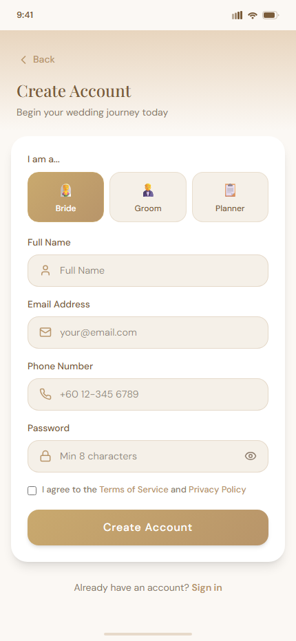
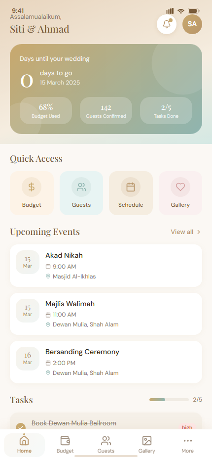
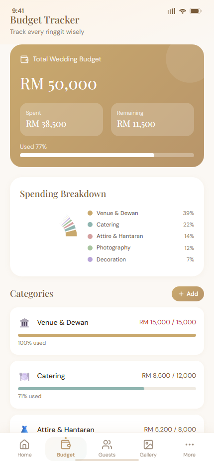
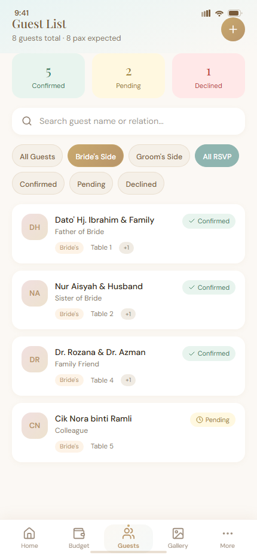
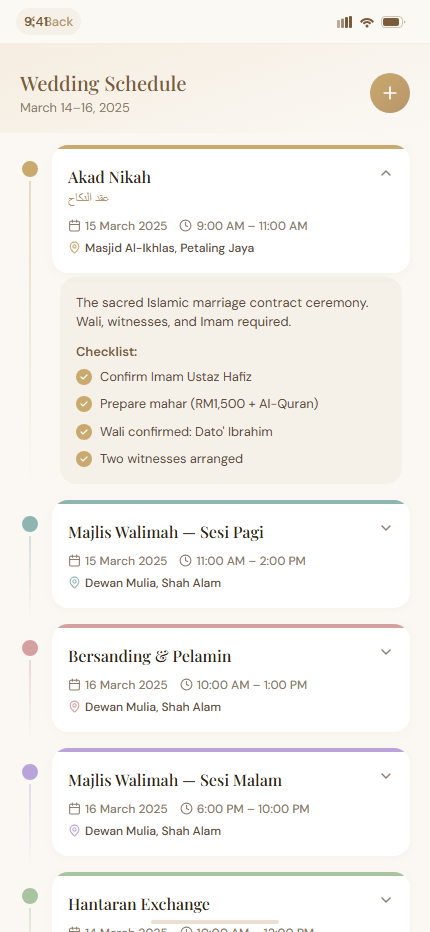
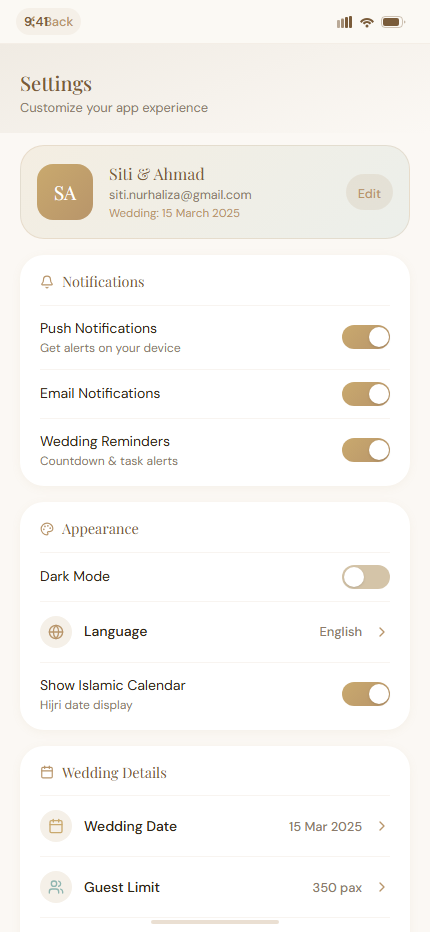
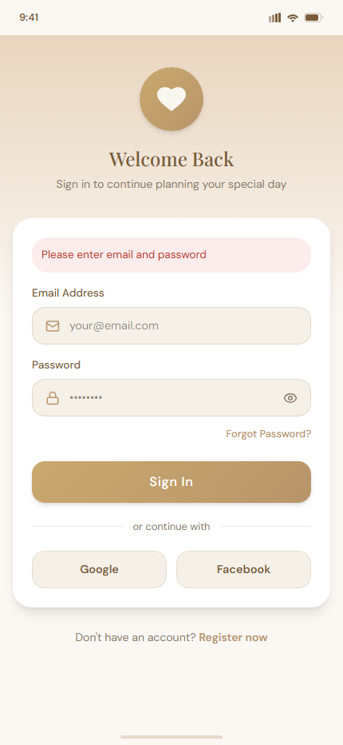

# Logbook & Technical Report — CAT Mobile Application

**Module:** Mobile Application Development  
**Project:** Nikah Planner — Wedding planning mobile app  
**Student:** Hadidja Aliani  
**Student ID:** BIT/2023/62116  
**GitHub account:** [moinaalia](https://github.com/moinaalia)  
**Source repository:** https://github.com/moinaalia/nikah-planner  
**Submission date:** June 2026

> **Complete document (recommended):** Download **[LOGBOOK.doc](LOGBOOK.doc)** — full English report with all screenshots embedded.


---

## Table of contents

1. [Project overview](#1-project-overview)
2. [CAT requirements coverage](#2-cat-requirements-coverage)
3. [Implemented modules](#3-implemented-modules)
4. [Grading (instructor)](#4-grading-instructor)
5. [Technical architecture](#5-technical-architecture)
6. [Local storage and data retrieval](#6-local-storage-and-data-retrieval)
7. [Networking and API consumption](#7-networking-and-api-consumption)
8. [Error handling](#8-error-handling)
9. [Development phases (logbook)](#9-development-phases-logbook)
10. [Testing and demonstration instructions](#10-testing-and-demonstration-instructions)
11. [Required screenshots](#11-required-screenshots)
12. [Revision questions](#12-revision-questions)
13. [References](#13-references)
14. [Appendices](#14-appendices)

---

## 1. Project overview

### 1.1 Context

Nikah Planner is an Android mobile application that helps couples plan their wedding: budget, guest list, ceremony schedule, vendors, and notifications. This project extends the UI prototype developed earlier in the semester into a full Flutter application.

### 1.2 CAT objectives

Build a complete mobile application covering concepts from weeks 1 to 5:

| CAT requirement | Nikah Planner implementation |
|-----------------|------------------------------|
| User Interface Design | 13 Material Design screens, gold/sage theme |
| Navigation | `go_router` + 5-tab bottom navigation |
| Event Handling | Buttons, forms, filters, `onTap`, `onChanged` |
| Local Data Storage | Embedded data (`mock_data.dart`) + `SharedPreferences` |
| Data Retrieval | Data loaded and displayed on each screen |
| Networking | Firebase Auth + Firestore (cloud) |
| API Consumption | REST via Firebase SDK |
| Error Handling | Login/register error messages, form validation |

### 1.3 Technologies

| Layer | Technology |
|-------|------------|
| Mobile | Flutter 3.x / Dart |
| Navigation | go_router |
| State | Riverpod |
| Local storage | SharedPreferences + embedded data |
| Cloud backend | Firebase Auth + Cloud Firestore |
| Web prototype | React + Vite (browser demo) |
| Version control | Git / GitHub |

---

## 2. CAT requirements coverage

### 2.1 User Interface Design

**Implementation:**
- Animated splash screen (`lib/features/splash/splash_screen.dart`)
- Consistent theme: gold (#B8956A), sage (#8FB5B0), Playfair Display + DM Sans fonts
- Reusable components: `WeddingCard`, `PrimaryButton`, `WeddingInputField`
- 13 responsive screens with `CustomScrollView`, charts (`fl_chart`)

**Key files:** `lib/core/theme/`, `lib/core/widgets/wedding_widgets.dart`

**Screenshots:**

<p align="center">



</p>

**Instructor mark:** ____________ / 5  
**Comments:** _______________________________________________

---

### 2.2 Navigation

**Implementation:**
- `GoRouter` with named routes (`lib/router/app_router.dart`)
- Tab navigation: Home, Budget, Guests, Gallery, More (`MainShell`)
- Stack navigation to sub-pages: Schedule, Vendors, Profile, Settings
- Flow: Splash → Login → Dashboard

**Route examples:**
```
/splash → /login → /register → /home
/home, /budget, /guests, /gallery, /more
/schedule, /vendors, /profile, /settings, /notifications
```

**Screenshot:**

<p align="center"></p>

**Instructor mark:** ____________ / 4  
**Comments:** _______________________________________________

---

### 2.3 Event Handling

**Handled events:**
- Tap on Login / Register buttons
- Text input via `TextEditingController`
- RSVP and bride/groom side filters (Guest List)
- Event expansion in Schedule (`setState`)
- Notification toggles in Settings
- `onTap` navigation to sub-screens

**Files:** `login_screen.dart`, `register_screen.dart`, `guest_list_screen.dart`, `schedule_screen.dart`

**Screenshots:**

<p align="center">

</p>

**Instructor mark:** ____________  
**Comments:** _______________________________________________

---

### 2.4 Local Data Storage

**Implementation:**

| Method | Role | File |
|--------|------|------|
| Embedded data | Budget, guests, events (demo mode) | `lib/core/data/mock_data.dart` |
| SharedPreferences | User accounts and wedding profiles (JSON) | `lib/services/local_wedding_store.dart` |
| In-memory session | Active couple data | `lib/services/wedding_session.dart` |

**Local storage structure (SharedPreferences):**
```
nikah_local_users     → { userId: { email, password, name, weddingId } }
nikah_local_weddings  → { weddingId: { full profile JSON } }
nikah_email_index     → { email: userId }
```

**Temporary vs permanent storage:** see section 12.1

**Instructor mark:** ____________ / 5  
**Comments:** _______________________________________________

---

### 2.5 Data Retrieval

**Implementation:**
- `MockData` exposes getters read by all screens (budget, guests, events, etc.)
- `WeddingRepository.loadForUser()` loads profile from SharedPreferences or Firestore
- `WeddingSession` provides active data after login
- Guest filters: search + RSVP + bride/groom side

**Flow:**
```
Login → loadForUser(userId) → WeddingSession.activate(profile) → MockData reads session → UI displays
```

**Instructor mark:** ____________ / 4  
**Comments:** _______________________________________________

---

### 2.6 Networking

**Implementation:**
- **Firebase Authentication:** account creation, email/password sign-in
- **Cloud Firestore:** collections `users/`, `weddings/`, sub-collection `guests/`
- Firebase SDK = async HTTP client to Google Cloud API

**Files:** `lib/services/auth_service.dart`, `lib/services/firestore_service.dart`

**Demo mode (no network):** the app works offline with local storage when Firebase is not configured.

**Instructor mark (Networking):** ____________  
**Comments:** _______________________________________________

---

### 2.7 API Consumption

**API used:** Firebase REST/SDK

| Operation | Type | Service |
|-----------|------|---------|
| Registration | POST (createUser) | Firebase Auth |
| Sign in | POST (signIn) | Firebase Auth |
| Create wedding | POST (set document) | Firestore |
| Read profile | GET (get document) | Firestore |
| Guest stream | GET (snapshots) | Firestore |

**Data format:** JSON (Firestore documents, `WeddingProfile.toJson()` serialization)

**Instructor mark (API / Networking total):** ____________ / 5  
**Comments:** _______________________________________________

---

### 2.8 Error Handling

**Implementation:**

| Situation | Handling |
|-----------|----------|
| Empty login fields | Message: "Please enter email and password" |
| Password < 8 characters | Message on registration |
| Email already registered | "This email is already registered" |
| Account not found | "Account not found. Please register first." |
| Wrong password | "Incorrect password" |
| Firebase error | `FirebaseAuthException` → displayed message |
| Firebase not configured | Automatic fallback to demo mode |

**File:** `lib/services/auth_service.dart` → `AuthResult` class

**Screenshot:**

<p align="center"></p>

**Instructor mark:** ____________ / 3  
**Comments:** _______________________________________________

---

## 3. Implemented modules

Mapping to suggested CAT modules:

| Suggested module | Nikah Planner module | File | Instructor mark |
|------------------|----------------------|------|-----------------|
| 1. Login Screen | Sign-in screen | `lib/features/auth/login_screen.dart` | |
| 2. Dashboard | Home (countdown, tasks, stats) | `lib/features/home/home_screen.dart` | |
| 3. Student Registration | Couple / user registration | `lib/features/auth/register_screen.dart` | |
| 4. Local Database | SharedPreferences + mock data | `local_wedding_store.dart`, `mock_data.dart` | |
| 5. API Integration | Firebase Auth + Firestore | `auth_service.dart`, `firestore_service.dart` | |
| 6. Reports Screen | Budget report (chart + transactions) | `lib/features/budget/budget_screen.dart` | |

**Additional screens:** Guests, Gallery, Schedule, Vendors, Profile, Invitations, Notifications, Settings.

**Module comments:** _______________________________________________

---

## 4. Grading (instructor)

*To be completed by the instructor.*

| Criterion | Max | Evidence in project | Mark |
|-----------|-----|---------------------|------|
| User Interface Design | 5 | 13 screens, consistent theme, reusable widgets | |
| Navigation | 4 | GoRouter, 5 tabs, sub-pages | |
| Local Storage | 5 | SharedPreferences + mock_data | |
| Data Retrieval | 4 | MockData, WeddingRepository, filters | |
| Networking / API | 5 | Firebase Auth + Firestore | |
| Error Handling | 3 | AuthResult, UI error messages | |
| Code Quality | 2 | features/, services/ structure, Flutter lints | |
| Documentation | 2 | README, this logbook, SOUMISSION_PROF.md | |
| **Total** | **30** | | |

**Instructor signature:** _________________________  
**Date:** _________________________

---

## 5. Technical architecture

```
┌─────────────────────────────────────────┐
│              UI Layer (Flutter)          │
│  Splash → Login/Register → Dashboard    │
│  Budget | Guests | Schedule | Settings   │
└─────────────────┬───────────────────────┘
                  │
┌─────────────────▼───────────────────────┐
│           Services Layer                 │
│  AuthService | WeddingRepository         │
│  FirestoreService | LocalWeddingStore    │
└─────────┬───────────────┬───────────────┘
          │               │
   ┌──────▼──────┐  ┌─────▼──────┐
   │ Local Store │  │  Firebase  │
   │ SharedPrefs │  │ Auth + DB  │
   └─────────────┘  └────────────┘
```

**Pattern:** Repository pattern — `WeddingRepository` abstracts the data source (local or cloud).

---

## 6. Local storage and data retrieval

### 6.1 Embedded data (instructor demo mode)

File `mock_data.dart` — sample data for Siti & Ahmad to test without an account:
- 8 budget categories, 8 guests, 6 events, 7 vendors

### 6.2 Persistent storage (SharedPreferences)

Each registered user gets a private workspace:
- Registration → `WeddingDataFactory.createNew()` → JSON save
- Login → `loadForUser()` → personal data displayed

### 6.3 Retrieval example

```dart
// Simplified example
final profile = await WeddingRepository.instance.loadForUser(userId);
WeddingSession.activate(profile);
// Screens read MockData which points to WeddingSession
```

---

## 7. Networking and API consumption

### 7.1 Client-server architecture

```
[Flutter App]  ←→  [Firebase Auth API]     (authentication)
[Flutter App]  ←→  [Cloud Firestore API]   (wedding data)
```

### 7.2 Firestore collections

```
users/{userId}          → email, name, role, weddingId
weddings/{weddingId}    → brideName, groomName, weddingDate, budget...
weddings/{id}/guests/   → guest list
```

### 7.3 Asynchronous processing

All network operations use `async/await`:
- `signIn()`, `register()`, `createWeddingProfile()`, `loadForUser()`

---

## 8. Error handling

```dart
// AuthResult pattern used across the app
final result = await authService.signIn(email: email, password: password);
if (result.isSuccess) {
  context.go('/home');
} else {
  setState(() => _error = result.error);  // Display to user
}
```

**Principles:**
- Client-side validation before API calls
- Catch `FirebaseAuthException` with readable messages
- Graceful fallback when Firebase is unavailable (demo mode)

---

## 9. Development phases (logbook)

| Week | Date | Activity | Status | Instructor mark |
|------|------|----------|--------|-----------------|
| 1 | [Date] | Requirements analysis, React UI mockup | Done | |
| 2 | [Date] | Flutter project setup, theme, Splash | Done | |
| 3 | [Date] | Login, Register, GoRouter navigation | Done | |
| 4 | [Date] | Dashboard, Budget, Guests, Schedule | Done | |
| 5 | [Date] | Local storage with SharedPreferences | Done | |
| 5 | [Date] | Firebase integration (Auth + Firestore) | Done | |
| 6 | [Date] | Android testing, APK build, GitHub publish | Done | |
| 6 | [Date] | Documentation and logbook | Done | |

**Logbook comments:** _______________________________________________

---

## 10. Testing and demonstration instructions

### 10.1 Mobile application (instructor)

```bash
git clone https://github.com/moinaalia/nikah-planner.git
cd nikah-planner/nikah_planner
flutter pub get
flutter run
```

**Recommended demo flow:**
1. Splash screen → Login
2. Demo sign-in (any email + password after registration, or demo data)
3. Dashboard: countdown, tasks, budget stats
4. Budget: pie chart + transactions (Reports)
5. Guests: RSVP filters
6. Schedule: event timeline
7. Settings → Sign Out

### 10.2 Web prototype (browser)

```bash
cd nikah-planner
npm install
npm run dev
# Open http://localhost:5173
```

### 10.3 Personal account (registration)

1. Register → fill form → Create Account
2. Each email = separate private workspace
3. Sign Out → create a second account → show different data

---

## 11. Required screenshots

Screenshots required by the CAT instructions:

### 11.1 Splash screen

<p align="center"></p>

### 11.2 Login screen

<p align="center"></p>

### 11.3 Register screen

<p align="center"></p>

### 11.4 Dashboard (Home)

<p align="center"></p>

### 11.5 Budget / Reports

<p align="center"></p>

### 11.6 Guest list and filters

<p align="center"></p>

### 11.7 Schedule

<p align="center"></p>

### 11.8 Settings and profile

<p align="center"></p>

### 11.9 Login error message

<p align="center"></p>

**How to capture:** Android emulator, or `flutter run` on a phone, then screenshot.

---

## 12. Revision questions

### 12.1 Temporary vs permanent storage

| Temporary | Permanent |
|-----------|-----------|
| RAM / in-memory session (`WeddingSession`) | SharedPreferences on disk |
| Lost when app closes | Persists after restart |
| `setState` variables | JSON file in SharedPreferences |
| Example: active guest filter | Example: saved user account |

### 12.2 Explain SQLite

SQLite is a lightweight relational database embedded on the mobile device. It stores data in tables using SQL (SELECT, INSERT, UPDATE). It is an alternative to SharedPreferences for complex structured data. *Nikah Planner uses SharedPreferences (key-value JSON); SQLite could be added for large guest lists.*

### 12.3 Define API

An **API** (Application Programming Interface) is an interface that allows two programs to communicate. On mobile, the app (client) sends HTTP requests to a server (e.g. Firebase) and receives JSON responses.

### 12.4 Explain asynchronous processing

**Asynchronous** processing lets the app keep running during long operations (network, disk). In Dart: `async/await` and `Future`. Example: `await authService.signIn()` does not freeze the UI.

### 12.5 Compare GET and POST

| GET | POST |
|-----|------|
| Retrieve data | Send / create data |
| Parameters in URL | Data in request body |
| Example: read Firestore profile | Example: create Firebase Auth account |
| Idempotent | May modify the server |

### 12.6 Client-server architecture

The **client** (Flutter mobile app) sends requests to the **server** (Firebase Cloud). The server processes them, accesses the database, and returns a response. The app never accesses the server database directly without going through the API.

### 12.7 Explain JSON

**JSON** (JavaScript Object Notation) is a text format for structured data: `{ "brideName": "Siti", "budget": 15000 }`. Used by Firestore and SharedPreferences in Nikah Planner.

### 12.8 Design an app with storage and networking

Nikah Planner illustrates this design:
1. **Registration** → POST Firebase Auth + local save
2. **Read** → GET Firestore or SharedPreferences
3. **Display** → Flutter UI reads `MockData` / `WeddingSession`
4. **Offline** → local storage fallback when no network

---

## 13. References

1. Android Developer Documentation — https://developer.android.com  
2. Flutter Documentation — https://docs.flutter.dev  
3. Firebase Documentation — https://firebase.google.com/docs  
4. SQLite Documentation — https://www.sqlite.org/docs.html  
5. REST API Design — https://restfulapi.net  
6. SharedPreferences (Flutter) — package `shared_preferences`  
7. Project repository — https://github.com/moinaalia/nikah-planner  

---

## 14. Appendices

### A. Submission links

| Item | Link |
|------|------|
| Source code | https://github.com/moinaalia/nikah-planner |
| GitHub profile | https://github.com/moinaalia |
| README | https://github.com/moinaalia/nikah-planner#readme |
| Complete report (Word) | [LOGBOOK.doc](LOGBOOK.doc) — full text + embedded screenshots |

### B. CAT submission checklist

- [x] Source code on GitHub
- [x] Screenshots (section 11)
- [x] Technical report / logbook ([LOGBOOK.md](LOGBOOK.md))
- [ ] Live demonstration (emulator or phone)

### C. Repository structure

```
nikah-planner/
├── nikah_planner/     ← Flutter app (main CAT deliverable)
├── LOGBOOK.doc        ← Complete CAT report (Word)
├── src/               ← React prototype
├── README.md
├── LOGBOOK.md         ← CAT technical report (English, with screenshots)
├── SOUMISSION_PROF.md
└── screenshots/       ← UI screenshots (embedded in LOGBOOK.md)
```

---

*Report prepared in accordance with CAT instructions — Mobile Application Development.*
